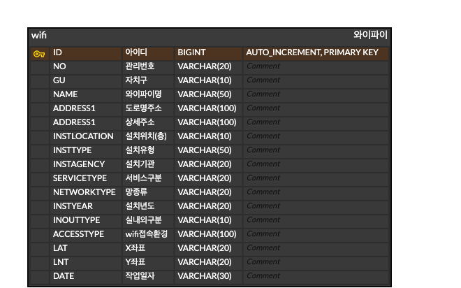

# Mission1 [내 위치 기반 공공 와이파이 정보를 제공하는 웹서비스 개발]

## 프로젝트 수행 목적
#### 자바와 웹, 데이터베이스 개념과 응용을 통하여 스킬 업

## 프로젝트 간략 소개
- 공공 데이터 자원을 끌어와서 내가 서비스 하고자 하는 데이터로 마이그레이션하여 웹을 기반으로 하여 원하는 형태로 출력
- 사용한 히스토리에 대해서 데이터베이스에 저장하는 기능과 이를 출력하는 기능을 구현

## 프로젝트 기간
#### 22.10.17 ~ 22.10.19

## 개발환경
- PC : MacBook Air M1 16GB
- Language : Java 1.8.0_342(corretto-1.8)
- DBMS : Mysql 8.0.30-0ubuntu0.22.04.1 for Linux on aarch64 (In the docker container v20.10.17)
- Server : Apache Tomcat 8.5.83
- IDE : IntelliJ IDEA 2022.2.2 (Ultimate Edition)

## 수행영상
### 내 위치 가져오기

### 근처 WIFI 정보 가져오기


### 위치 히스토리 목록


## ERD
### WIFI

### WIFI_HISTORY


### SQL
```sql
create table wifi(
    id bigint auto_increment primary key,
    no varchar(20),
    gu varchar(10),
    name varchar(50),
    address1 varchar(100),
    address2 varchar(100),
    instLocation varchar(10),
    instType varchar(50),
    instAgency varchar(20),
    serviceType varchar(20),
    networkType varchar(20),
    instYear varchar(20),
    inOutType varchar(10),
    accessType varchar(100),
    x varchar(20),
    y varchar(20),
    date varchar(30)
);

create table wifi_history(
    id bigint auto_increment primary key,
    x varchar(20),
    y varchar(20),
    date varchar(30),
    is_del varchar(1) check ( is_del IN ('Y', 'N'))
);
```


